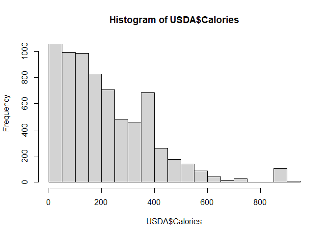

Study Food Nutrients
================

## GitHub Documents

This is an R Markdown format used for publishing markdown documents to
GitHub. When you click the **Knit** button all R code chunks are run and
a markdown file (.md) suitable for publishing to GitHub is generated.

## Including Code

You can include R code in the document as follows:

``` r
USDA = read.csv("USDA.csv")
summary(USDA)
```

    ##        ID        Description           Calories        Protein     
    ##  Min.   : 1001   Length:7058        Min.   :  0.0   Min.   : 0.00  
    ##  1st Qu.: 8387   Class :character   1st Qu.: 85.0   1st Qu.: 2.29  
    ##  Median :13294   Mode  :character   Median :181.0   Median : 8.20  
    ##  Mean   :14260                      Mean   :219.7   Mean   :11.71  
    ##  3rd Qu.:18337                      3rd Qu.:331.0   3rd Qu.:20.43  
    ##  Max.   :93600                      Max.   :902.0   Max.   :88.32  
    ##                                     NA's   :1       NA's   :1      
    ##     TotalFat       Carbohydrate        Sodium         SaturatedFat   
    ##  Min.   :  0.00   Min.   :  0.00   Min.   :    0.0   Min.   : 0.000  
    ##  1st Qu.:  0.72   1st Qu.:  0.00   1st Qu.:   37.0   1st Qu.: 0.172  
    ##  Median :  4.37   Median :  7.13   Median :   79.0   Median : 1.256  
    ##  Mean   : 10.32   Mean   : 20.70   Mean   :  322.1   Mean   : 3.452  
    ##  3rd Qu.: 12.70   3rd Qu.: 28.17   3rd Qu.:  386.0   3rd Qu.: 4.028  
    ##  Max.   :100.00   Max.   :100.00   Max.   :38758.0   Max.   :95.600  
    ##  NA's   :1        NA's   :1        NA's   :84        NA's   :301     
    ##   Cholesterol          Sugar           Calcium             Iron        
    ##  Min.   :   0.00   Min.   : 0.000   Min.   :   0.00   Min.   :  0.000  
    ##  1st Qu.:   0.00   1st Qu.: 0.000   1st Qu.:   9.00   1st Qu.:  0.520  
    ##  Median :   3.00   Median : 1.395   Median :  19.00   Median :  1.330  
    ##  Mean   :  41.55   Mean   : 8.257   Mean   :  73.53   Mean   :  2.828  
    ##  3rd Qu.:  69.00   3rd Qu.: 7.875   3rd Qu.:  56.00   3rd Qu.:  2.620  
    ##  Max.   :3100.00   Max.   :99.800   Max.   :7364.00   Max.   :123.600  
    ##  NA's   :288       NA's   :1910     NA's   :136       NA's   :123      
    ##    Potassium          VitaminC           VitaminE          VitaminD       
    ##  Min.   :    0.0   Min.   :   0.000   Min.   :  0.000   Min.   :  0.0000  
    ##  1st Qu.:  135.0   1st Qu.:   0.000   1st Qu.:  0.120   1st Qu.:  0.0000  
    ##  Median :  250.0   Median :   0.000   Median :  0.270   Median :  0.0000  
    ##  Mean   :  301.4   Mean   :   9.436   Mean   :  1.488   Mean   :  0.5769  
    ##  3rd Qu.:  348.0   3rd Qu.:   3.100   3rd Qu.:  0.710   3rd Qu.:  0.1000  
    ##  Max.   :16500.0   Max.   :2400.000   Max.   :149.400   Max.   :250.0000  
    ##  NA's   :409       NA's   :332        NA's   :2720      NA's   :2834

## Including Plots

You can also embed plots, for example:

<!-- -->

Note that the `echo = FALSE` parameter was added to the code chunk to
prevent printing of the R code that generated the plot.
